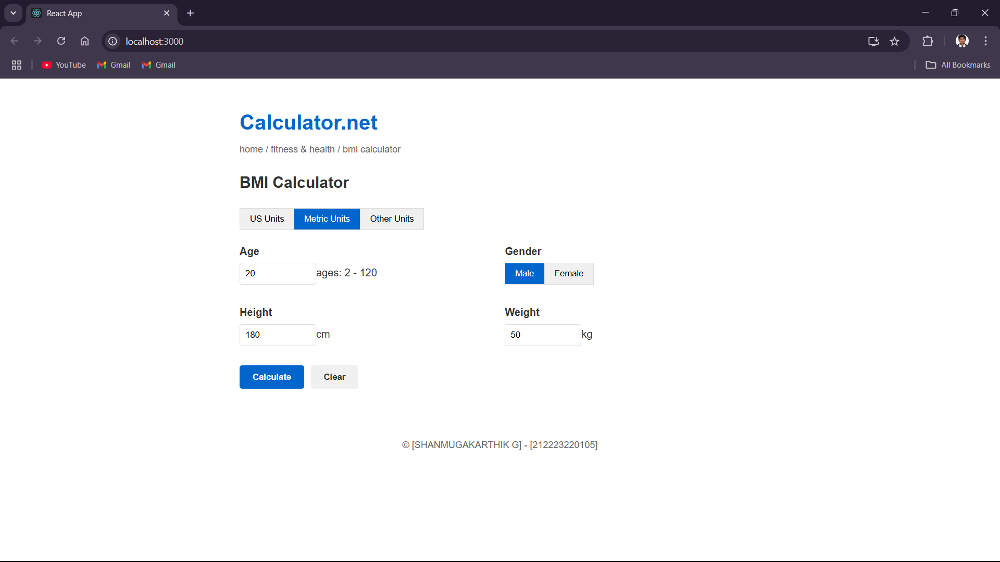

# Ex06 BMI Calculator
## Date: 28/05/2025

## AIM
To develop a responsive and interactive Body Mass Index (BMI) Calculator using React that allows users to input their height and weight, and calculates their BMI to categorize their health status (e.g., Underweight, Normal, Overweight, Obese).

## DESIGN STEPS

### STEP 1: Initialize React Project

<li>Create a new React app using create-react-app.</li>
<li>Install React Router using:</li>
npm install react-router-dom

### STEP 2: Set Up Routing

Create routing structure with react-router-dom:

<li>Home route (/) – Intro or Navigation</li>

<li>BMI Calculator route (/bmi)</li>

<li>Result route (/result)</li>

### STEP 3: Design the BMI Form Page

<li>Create a form to accept Height (in cm or m) and Weight (in kg).</li>

<li>On form submit, navigate to the result page with entered values via URL query params or context/state.</li>

## STEP 4: Handle Input Validation

<li>Check if height and weight are valid numbers.</li>

<li>Optionally, show error messages for invalid inputs.</li>

### STEP 5: Perform BMI Calculation

<li>In the result component:

<li>Extract height and weight from the route (URL or passed state).</li>

<li>Apply the BMI formula:</li>


​
 
<li>Convert height from cm to m if needed.</li></li>

### STEP 6: Display Result

<li>Show calculated BMI.</li>

<li>Show category based on BMI range:

<li>Underweight, Normal, Overweight, Obese, etc.</li></li>

### STEP 7: Navigation Options

<li>Provide a button to go back to the BMI form to calculate again.</li>

### STEP 8: Enhancements

<li>Add styling using CSS or Tailwind.</li>

## PROGRAM
## APP.js
```
import React, { useState } from 'react';
import './App.css';

function App() {
  const [unit, setUnit] = useState('metric');
  const [age, setAge] = useState(20);
  const [gender, setGender] = useState('male');
  const [height, setHeight] = useState(180);
  const [weight, setWeight] = useState(80);
  const [bmiResult, setBmiResult] = useState(null);

  const calculateBMI = () => {
    // BMI calculation: weight (kg) / (height (m))^2
    const heightInMeters = height / 100;
    const bmi = (weight / (heightInMeters * heightInMeters)).toFixed(1);
    
    // Determine BMI category
    let category = '';
    let percentage = 0;
    
    if (bmi < 18.5) {
      category = 'Underweight';
      percentage = Math.round((bmi / 18.5) * 100);
    } else if (bmi >= 18.5 && bmi < 25) {
      category = 'Healthy weight';
      percentage = Math.round(((bmi - 18.5) / (25 - 18.5)) * 100);
    } else if (bmi >= 25 && bmi < 30) {
      category = 'Overweight';
      percentage = Math.round(((bmi - 25) / (30 - 25)) * 100);
    } else {
      category = 'Obese';
      percentage = Math.round(((bmi - 30) / (40 - 30)) * 100);
    }
    
    // Calculate healthy weight range
    const minHealthyWeight = (18.5 * heightInMeters * heightInMeters).toFixed(1);
    const maxHealthyWeight = (25 * heightInMeters * heightInMeters).toFixed(1);
    
    // Calculate percentiles (simplified for demo)
    const weightPercentile = Math.min(100, Math.round(50 + (bmi - 22) * 10));
    const heightPercentile = Math.min(100, Math.round(50 + (height - 170) / 2));
    
    // Calculate Ponderal Index
    const ponderalIndex = (weight / (heightInMeters * heightInMeters * heightInMeters)).toFixed(1);
    
    setBmiResult({
      bmi,
      category,
      percentage,
      weightPercentile,
      heightPercentile,
      minHealthyWeight,
      maxHealthyWeight,
      ponderalIndex
    });
  };

  const clearForm = () => {
    setAge(20);
    setGender('male');
    setHeight(180);
    setWeight(80);
    setBmiResult(null);
  };

  return (
    <div className="calculator-container">
      <header>
        <h1>Calculator.net</h1>
        <nav>
          <span>home / fitness & health / bmi calculator</span>
        </nav>
      </header>

      <main>
        <h2>BMI Calculator</h2>
        
        <div className="unit-tabs">
          <button className={unit === 'us' ? 'active' : ''} onClick={() => setUnit('us')}>US Units</button>
          <button className={unit === 'metric' ? 'active' : ''} onClick={() => setUnit('metric')}>Metric Units</button>
          <button className={unit === 'other' ? 'active' : ''} onClick={() => setUnit('other')}>Other Units</button>
        </div>

        <div className="input-form">
          <div className="input-group">
            <label>Age</label>
            <input 
              type="number" 
              value={age} 
              onChange={(e) => setAge(e.target.value)} 
              min="2" 
              max="120" 
            />
            <span>ages: 2 - 120</span>
          </div>

          <div className="input-group">
            <label>Gender</label>
            <div className="gender-options">
              <button 
                className={gender === 'male' ? 'active' : ''}
                onClick={() => setGender('male')}
              >
                Male
              </button>
              <button 
                className={gender === 'female' ? 'active' : ''}
                onClick={() => setGender('female')}
              >
                Female
              </button>
            </div>
          </div>

          <div className="input-group">
            <label>Height</label>
            <input 
              type="number" 
              value={height} 
              onChange={(e) => setHeight(e.target.value)} 
            />
            <span>cm</span>
          </div>

          <div className="input-group">
            <label>Weight</label>
            <input 
              type="number" 
              value={weight} 
              onChange={(e) => setWeight(e.target.value)} 
            />
            <span>kg</span>
          </div>

          <div className="action-buttons">
            <button className="calculate" onClick={calculateBMI}>Calculate</button>
            <button className="clear" onClick={clearForm}>Clear</button>
          </div>
        </div>

        {bmiResult && (
          <div className="result-section">
            <h3>Result</h3>
            <h4>BMI = {bmiResult.bmi} kg/m<sup>2</sup> ({bmiResult.percentage}%, {bmiResult.category})</h4>
            
            <ul>
              <li>BMI = {bmiResult.bmi}</li>
              <li>Weight-for-age percentile: {bmiResult.weightPercentile}%</li>
              <li>Height-for-age percentile: {bmiResult.heightPercentile}%</li>
              <li>Healthy BMI range: 19.1 - 27 kg/m<sup>2</sup></li>
              <li>Healthy weight for the height: {bmiResult.minHealthyWeight} kg - {bmiResult.maxHealthyWeight} kg</li>
              <li>Ponderal Index: {bmiResult.ponderalIndex} kg/m<sup>3</sup></li>
            </ul>
          </div>
        )}
      </main>

      <footer>
        <p>&copy; [SHANMUGAKARTHIK G] - [212223220105]</p>
      </footer>
    </div>
  );
}

export default App;
```
## APP.css
```
body {
  font-family: Arial, sans-serif;
  line-height: 1.6;
  margin: 0;
  padding: 0;
  color: #333;
}

.calculator-container {
  max-width: 800px;
  margin: 0 auto;
  padding: 20px;
}

header h1 {
  color: #0066cc;
  margin-bottom: 5px;
}

header nav {
  color: #666;
  font-size: 0.9em;
  margin-bottom: 20px;
}

.unit-tabs {
  display: flex;
  margin-bottom: 20px;
}

.unit-tabs button {
  padding: 8px 15px;
  background: #f0f0f0;
  border: 1px solid #ddd;
  border-right: none;
  cursor: pointer;
}

.unit-tabs button:last-child {
  border-right: 1px solid #ddd;
}

.unit-tabs button.active {
  background: #0066cc;
  color: white;
}

.input-form {
  display: grid;
  grid-template-columns: 1fr 1fr;
  gap: 15px;
}

.input-group {
  margin-bottom: 15px;
}

.input-group label {
  display: block;
  margin-bottom: 5px;
  font-weight: bold;
}

.input-group input {
  width: 100px;
  padding: 8px;
  border: 1px solid #ddd;
  border-radius: 4px;
}

.gender-options {
  display: flex;
}

.gender-options button {
  padding: 8px 15px;
  background: #f0f0f0;
  border: 1px solid #ddd;
  cursor: pointer;
}

.gender-options button.active {
  background: #0066cc;
  color: white;
}

.action-buttons {
  grid-column: span 2;
  display: flex;
  gap: 10px;
}

.action-buttons button {
  padding: 10px 20px;
  border: none;
  border-radius: 4px;
  cursor: pointer;
  font-weight: bold;
}

.action-buttons .calculate {
  background: #0066cc;
  color: white;
}

.action-buttons .clear {
  background: #f0f0f0;
  color: #333;
}

.result-section {
  margin-top: 30px;
  padding-top: 20px;
  border-top: 1px solid #ddd;
}

.result-section h4 {
  color: #0066cc;
}

.result-section ul {
  list-style-type: none;
  padding: 0;
}

.result-section li {
  margin-bottom: 8px;
}

footer {
  margin-top: 40px;
  padding-top: 20px;
  border-top: 1px solid #ddd;
  text-align: center;
  font-size: 0.9em;
  color: #666;
}
```
## OUTPUT

.png>)
.png>)
.png>)
## RESULT
The BMI Calculator successfully takes user input for height and weight, performs the BMI calculation in real-time using React state and event handling, and displays the BMI value along with the corresponding health category.
